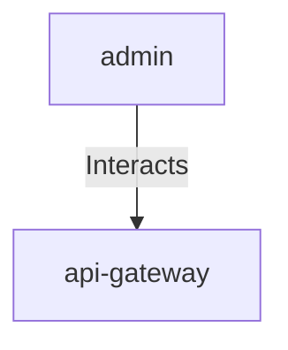

## Details

| Field               | Value                    |
|---------------------|--------------------------|
| **Unique ID**       | admin-uses-api-gateway                   |
| **Description**      |  Accesses system administration functions through the API gateway   |

## Related Nodes

## Controls
    _No controls defined._

## Metadata
  _No Metadata defined._
