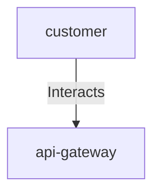

## Details

| Field               | Value                    |
|---------------------|--------------------------|
| **Unique ID**       | customer-uses-api-gateway                   |
| **Description**      |  Initiates requests through the API gateway to access platform services   |

## Related Nodes

## Controls
    _No controls defined._

## Metadata
  _No Metadata defined._
