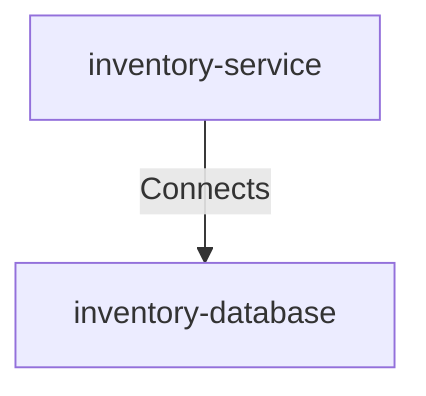

## Details

| Field               | Value                    |
|---------------------|--------------------------|
| **Unique ID**       | inventory-service-to-inventory-database                   |
| **Description**      |  Reads and writes inventory data to the inventory database   |

## Related Nodes

## Controls
    _No controls defined._

## Metadata
  

      <table>
          <thead>
          <tr>
              <th>Key</th>
              <th>Value</th>
          </tr>
          </thead>
          <tbody>
          <tr>
              <td>
                  <b>Latency Sla</b>
              </td>
              <td>
                  &lt; 150ms
                      </td>
          </tr>
          <tr>
              <td>
                  <b>Monitoring</b>
              </td>
              <td>
                  true
                      </td>
          </tr>
          <tr>
              <td>
                  <b>Connection Pooling</b>
              </td>
              <td>
                  true
                      </td>
          </tr>
          </tbody>
      </table>
  

